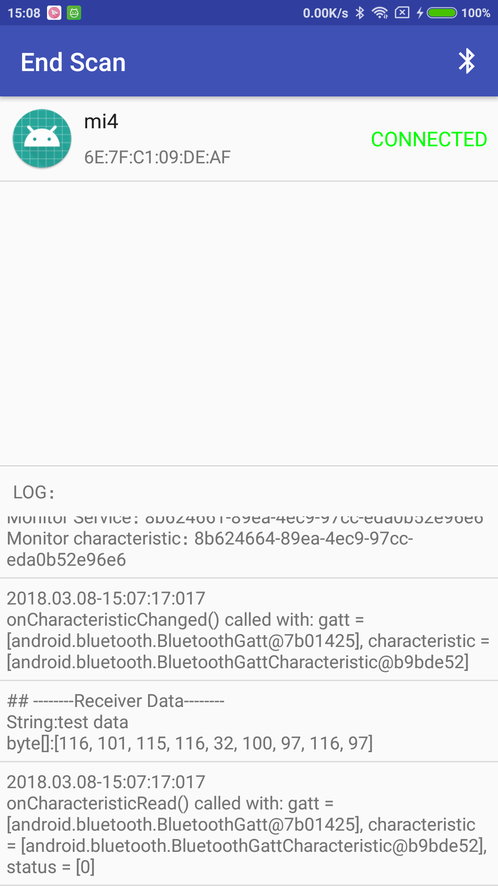

# Android 蓝牙开发，简易入门。

BLE（低功耗蓝牙）示例，搜索外围设备、连接、数据传输。
包含两个modle：BLE_Server和BLE_Client，分别安装在两部手机上进行操作。

### BLE_Server
模拟外围设备发送数据。

### BLE_Client
模拟中心设备接受数据。

# BLE_Client 效果预览

# 经典蓝牙
配对 - 建立连接 - 传输数据

# Chat
经典蓝牙的使用，实现文字聊天功能。

# A2DP
播放音乐